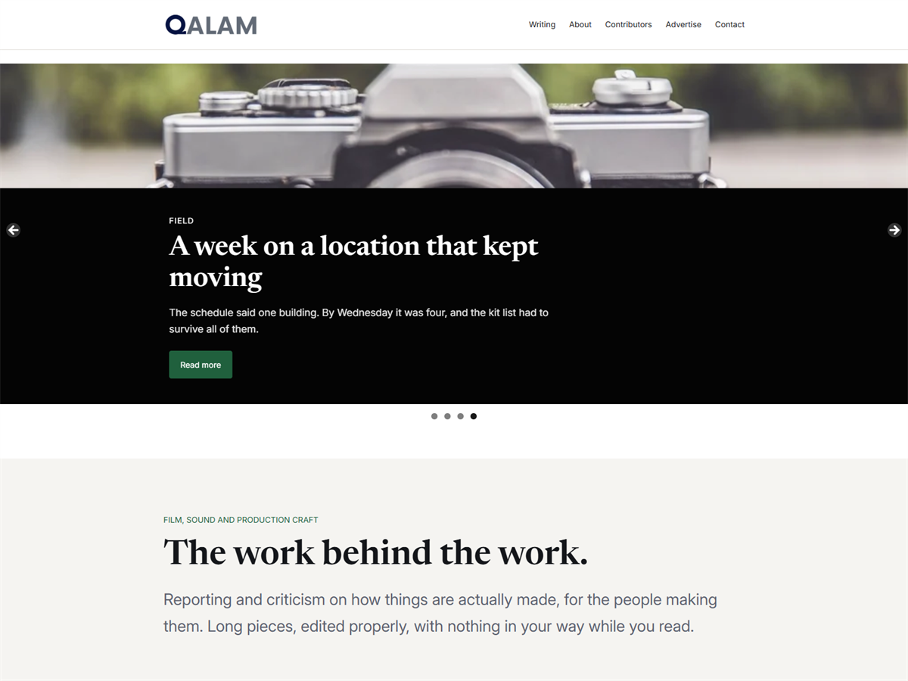

# Warqa

A fast, readable WordPress block theme for writers and publishers.

Warqa is built for long-form reading. Article text sits at a comfortable measure
of roughly seventy characters a line, headings follow a clear hierarchy in a
serif face, and the sidebar and reserved placement areas hold their space while
the page loads so nothing shifts under the reader.



## Features

- **Block theme** — full site editing, nine templates, three template parts
- **45 patterns** — full page layouts for a magazine front page, blog index,
  about, contact, media kit and long form legal documents, plus section
  patterns for newspaper fronts, card grids, ranked lists, quotation bands,
  contributor lists and numbered processes
- **Light and dark style variations** — every colour, size and spacing value is
  a preset you can change once and see applied everywhere
- **Fonts served locally** — Inter and Newsreader are bundled with the theme, so
  no request leaves your site to load them
- **Layout-stable placement areas** — empty containers with a fixed minimum
  height, so the page does not shift while anything loads into them
- **Translation ready** — `languages/warqa.pot` included, text domain `warqa`
- **No tracking** — no analytics, no advertising code, no third party scripts

## Requirements

| | |
|---|---|
| WordPress | 6.7 or later |
| PHP | 7.4 or later |
| Tested up to | WordPress 7.0 |

## Installation

**From a release**

1. Download the latest `warqa-x.y.z.zip` from the Releases page.
2. In WordPress go to **Appearance → Themes → Add New → Upload Theme**.
3. Choose the zip, install, then activate.

**From source**

```bash
git clone https://github.com/softglazee/warqa-wordpress-theme.git warqa
```

Place the `warqa` folder in `wp-content/themes/` and activate it. The directory
name must be `warqa` so it matches the theme's text domain.

## Getting started

1. **Appearance → Editor → Styles** to pick the light or dark variation, or edit
   the six palette colours directly.
2. Create a page and choose a pattern from the modal that appears, or open the
   inserter and look under **Warqa sections**.
3. For a landing page, choose the **Page, no title (landing)** template so the
   page title is not repeated above your own headline.

## Design tokens

Everything is driven by `theme.json` presets rather than hard-coded values.

| Type | Values |
|---|---|
| Colours | `base` `contrast` `muted` `accent` `surface` `line` |
| Font sizes | `small` `medium` `large` `x-large` `xx-large` |
| Spacing | `20` `30` `40` `50` `60` `70` |
| Font families | `body` (Inter) · `heading` (Newsreader) |

Content width is `42rem` and wide width is `64rem`. The content measure is set
for reading comfort; widening it will hurt readability.

## Development

The theme has no build step and no dependencies. Edit the files and reload.

```
style.css        Theme headers and the small amount of CSS theme.json cannot express
theme.json       Version 3. Settings, styles and presets. Most design work belongs here
functions.php    Theme supports, one enqueue, block styles, pattern category
templates/       Block templates
parts/           Header, footer, sidebar
patterns/        Registered automatically from this directory
styles/          Style variations
languages/       Translation template
```

## Credits

Bundled fonts, both under the SIL Open Font License 1.1:

- [Inter](https://github.com/rsms/inter) — Copyright 2020 The Inter Project Authors
- [Newsreader](https://github.com/productiontype/Newsreader) — Copyright 2019 The Newsreader Project Authors

Photography in `screenshot.png` is CC0 1.0. Full attribution is in
[`readme.txt`](readme.txt) under **Resources**.

## License

Warqa WordPress Theme, Copyright 2026 softglaze

Distributed under the terms of the GNU General Public License v2 or later. See
[LICENSE](LICENSE) for the full text.
